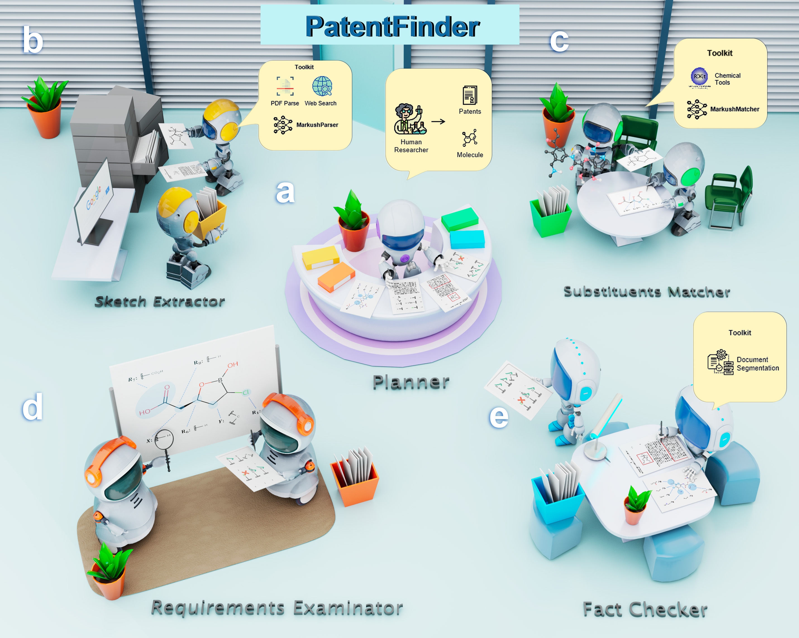

# PatentFinder

This repo is the official implementation of the paper "Intelligent System for Automated Molecular Patent Infringement Assessment".

Authors: Yaorui Shi∗, Sihang Li∗, Taiyan Zhang, Xi Fang, Jiankun Wang, Zhiyuan Liu, Guojiang Zhao, Zhengdan Zhu, Zhifeng Gao, Renxin Zhong, Linfeng Zhang, Guolin Ke, Weinan E, Hengxing Cai†, Xiang Wang†

Automated drug discovery offers significant potential for accelerating the development of novel therapeutics by substituting labor-intensive human workflows with machine-driven processes. 
However, molecules generated by artificial intelligence may unintentionally infringe on existing patents, posing legal and financial risks that impede the full automation of drug discovery pipelines.
This paper introduces PatentFinder, a novel multi-agent and tool-enhanced intelligence system that can accurately and comprehensively evaluate small molecules for patent infringement. 
PatentFinder features five specialized agents that collaboratively analyze patent claims and molecular structures with heuristic and model-based tools, generating interpretable infringement reports.
To support systematic evaluation, we curate MolPatent-240, a benchmark dataset tailored for patent infringement assessment algorithms.
On this benchmark, PatentFinder outperforms baseline methods that rely solely on large language models or specialized chemical tools, achieving a 13.8\% improvement in F1-score and a 12\% increase in accuracy.
Additionally, PatentFinder autonomously generates detailed and interpretable patent infringement reports, showcasing enhanced accuracy and improved interpretability.
The high accuracy and interpretability of PatentFinder make it a valuable and reliable tool for automating patent infringement assessments, offering a practical solution for integrating patent protection analysis into the drug discovery pipeline.



This repository contains the code for the following components of PatentFinder:
- The PatentFinder Framework
- MarkushMatcher
- MarkushParser

and the following datasets:
- MolPatent-240

# Requirements

The core libraries used in this project are recorded in `requirements.txt`. These packages can be installed using the following command:

```bash
pip install -r requirements.txt
```

We also provide a environment.yml file for conda users. You can create a conda environment using the following command:

```bash
conda env create -f environment.yml
```

# Usage

To run the PatentFinder, you can use the following command:

```bash
cd patent_finder
bash scripts/run_patent_finder.sh
```

For the MarkushMatcher model, you can run:

```bash
cd markush_matcher
bash scripts/markush_attach.sh
```

for data construction, and
    
```bash
bash scripts/train.sh
```

for training.